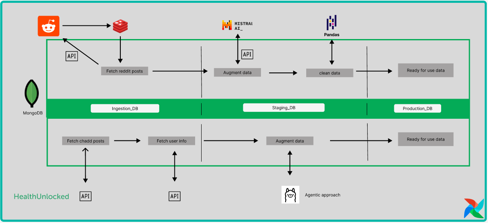

# DataEng 2024 Template Repository


Project [DATA Engineering](https://www.riccardotommasini.com/courses/dataeng-insa-ot/) is provided by [INSA Lyon](https://www.insa-lyon.fr/).

Students: **Youssef Sidhom, Nour Eljadiri**

### Abstract

Since 2018, awareness of mental health issues like ADHD has grown, influenced by social media trends on platforms like **Reddit** or even specialised website such as **HealthUnlocked**. This project will explore whether rising diagnosis rates align with increased social media discussions or if social media is reacting to these rates. Additionally, we will investigate the demographics of those medically diagnosed and self-diagnosed.

A major focus is to compare the rates of self-diagnosis with formal diagnoses.

## Datasets Description

The datasets for this project include:

* Social media posts from Reddit, and HealthUnlocked (these posts will be scrapped)

## Queries

### Assessing the Population Diagnosed with ADHD in Comparison with Social Media Mentions to Underline a Potential Link

*Objective:* To explore the potential correlation between formal ADHD diagnoses and the frequency of ADHD mentions on social media platforms.

Questions:

1. Annual Comparison:

* Detect the rise of adhd mentions in social media


2. Demographic Breakdown:

* What are the demographic profiles (age groups and gender) of individuals diagnosed with ADHD compared to those frequently discussing ADHD on social media?

    *Do certain demographics show a stronger correlation between diagnosis rates and social media mentions?*

4. Monthly Trends and Spikes:

* Are there specific months or seasons where spikes in ADHD diagnoses align with increased mentions of ADHD on social media platforms?

    *Could external factors (like awareness campaigns or events) be influencing these spikes?*

### Understanding the Trend of #self-diagnosis and #self-medication in the ADHD Context on Social Media

*Objective:* To analyze the prevalence and growth of the hashtags #self-diagnosis and #self-medication related to ADHD on social media platforms, and understand their implications.

Questions:

1. Trend Over Time:

* How has the number of social media posts containing the hashtags #self-diagnosis and #self-medication in the context of ADHD changed over time (e.g., monthly or yearly)?

    *Is there a significant increase or decrease in these mentions, and what might be influencing these trends?*

2. Proportion of Total Mentions:

* What percentage of all ADHD-related social media posts include references to self-diagnosis or self-medication?

    *How has this proportion evolved over time, and what does it suggest about changing attitudes or behaviors?*

3. Geographic Distribution:

* Which regions or countries have the highest number of social media mentions of #self-diagnosis and #self-medication related to ADHD?

    *Are there cultural, societal, or healthcare factors that might explain regional differences?*

4. Comparison with Professional Diagnoses Mentions:

* How do the trends in mentions of self-diagnosis compare to mentions of professional diagnoses on social media platforms?

    *Is there a shift in how people are discussing their ADHD diagnoses, and what might this indicate about trust in medical professionals or access to healthcare?*

## Requirements

### 1. Prequirements:
* Make sure you have docker installed 


### 2. Clone the Repository

Start by cloning the repository to your local machine:

```bash
git clone https://github.com/your-username/project-name.git
```
### 3. Initiate the docker containers
Once the git cloned just go to the airflow directory and run docker compose up

```bash
# for linux users
cd airflow
docker compose up 
```
```bash
# for windows users
cd airflow
docker-compose up
```
### 4. Populate the databases for the offline use
We will just run some scripts in order to populate the databases (Make sure the docker containers and running !!!)

```bash
#migration of mongodb
sh dags/migration/mongo/migration_mongo.sh
#migration of redis
sh dags/migration/redis/migration_redis.sh
```

→ Now everything should be running

## Data Engineering 
* In the following section, we will outline the entire pipeline we implemented to collect and clean the data, preparing it for effective analysis.*





## Ingestion phase
We will be detailling for each source the steps used in order to scrap get data.
### Reddit:
1. **Scrape Reddit**: The Reddit API is queried to fetch posts from the **r/adhd** subreddit. The posts are filtered based on predefined keywords related to ADHD, such as **self_diagnosis**, **self_medication**, and **personal_experience**.

2. **Check Redis for Duplicates**: Each post’s unique **ID** is checked against **Redis** to ensure it hasn’t already been processed. If the post ID is found in Redis, it is skipped to prevent duplication in the database.

3. **Store in MongoDB**: If a post is new, it is processed and stored in **MongoDB**. 
<details>
    <summary>The data collected</summary>

- **Post ID**: The unique identifier for the Reddit post.
- **Post Score**: The score assigned to the post, indicating its popularity.
- **Post Comments**: The number of comments on the post, reflecting engagement.
- **Post Upvotes**: The number of upvotes the post received, showing approval.
- **Post URL**: The URL of the Reddit post, providing direct access.
- **Post Subreddit**: The subreddit to which the post belongs (currently only considering '/adhd').
- **Post Title**: The title of the Reddit post, summarizing its content.
- **Post Content**: The text content of the Reddit post, detailing the discussion.
- **Post Author**: The author of the Reddit post, identifying the contributor.
- **Timestamp**: The timestamp when the post was created, indicating its recency.
- **Keywords**: The keywords used in the search that led to the retrieval of the post, highlighting relevant terms.

</details>


### Health Unlock

## Staging phase

### Reddit
Once the posts have been ingested into **MongoDB**, the next step involves moving the data into a **staging database** for augmentation. In this step, the text of the posts is passed to a **Large Language Model (LLM)**, such as **Mistral**, via an **API call** for further analysis and feature extraction. This allows us to enrich the collected data with additional insights that are valuable for analysis.

 1.**Using Mistral for Data Augmentation**

To analyze Reddit posts and extract key features, we use the **Mistral** LLM through an API call. Mistral helps with tasks like sentiment analysis, keyword extraction, and other valuable insights to enrich the dataset.

2.**Struggles in Automating LLM Analysis**

One key challenge in automating Reddit post analysis with an LLM, like Mistral, is ensuring the output is consistently structured for seamless integration into the data pipeline. Improving the prompting strategy is vital to align the model's responses with the desired format, simplifying parsing and feature extraction.


3.**Cleaning Augemented data**

After receiving analysis results from Mistral, the system formats and stores the augmented data in the staging database, with Pandas used for cleaning and ensuring consistency. Due to variability in the LLM’s output, additional adjustments may be required, such as:

Parsing the model output: Cleaning the response to match the database structure.
Handling inconsistent responses: Adjusting missing labels or misinterpreted keywords through post-processing.

### Unlock Health 


### Production phase

Once all the data cleaned it is transfered to the prodcution_db ready for analysis


